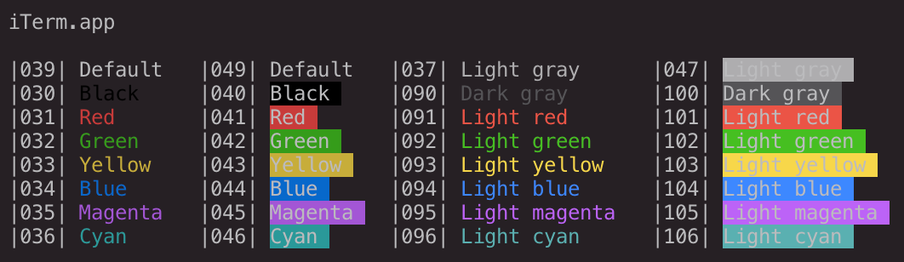
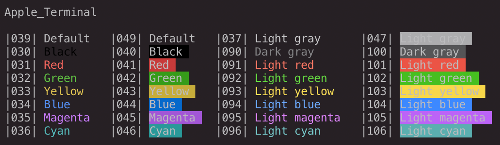

# Darcula FTW

This is an adjusted version of the Darcula color scheme by JetBrains.

## Base colors

Palette      | Hex       | RGB
---          | ---       | ---
Text         | `#bbbbbd` | `187 187 189`
Background   | `#252024` | `37 32 36`
Current line | `#323232` | `50 50 50`
Foreground   | `#a9b7c6` | `169 183 198`
Comment      | `#808080` | `128 128 128`

## ANSI colors

Palette      | Hex       | RGB
---          | ---       | ---
Black        | `#000000` | `0 0 0`
Red          | `#b94640` | `185 70 64`
Green        | `#379c1a` | `55 156 26`
Yellow       | `#c7ad3a` | `199 173 58`
Blue         | `#2d67c4` | `45 103 196`
Magenta      | `#985acf` | `152 90 207`
Cyan         | `#299999` | `41 153 153`
White        | `#adadaf` | `173 173 175`

## ANSI colors in iTerm2

Some colors in the iTerm2 profile had to be adjusted so that they look the same
as in the Terminal app:

Palette      | Hex       | RGB
---          | ---       | ---
Green        | `#549a34` | `84 154 52`
Yellow       | `#c3ae4f` | `195 174 79`
Cyan         | `#4e9798` | `78 151 152`

Even with the adjusted colors, the Terminal app seems to display the fonts
brighter than iTerm2:

### iTerm2

### Terminal

## Changes

Two things have been changed besides the color scheme:

 * No italic styles (just a matter of personal preference)
 * No green phpDoc comments (they are now gray like all other comments)

## Installation

Check the `README.md` files in the application folders for instructions.
